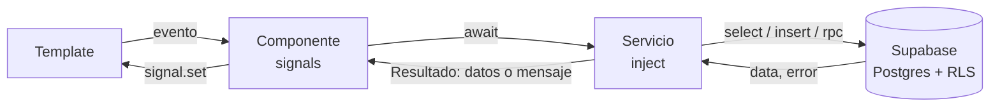
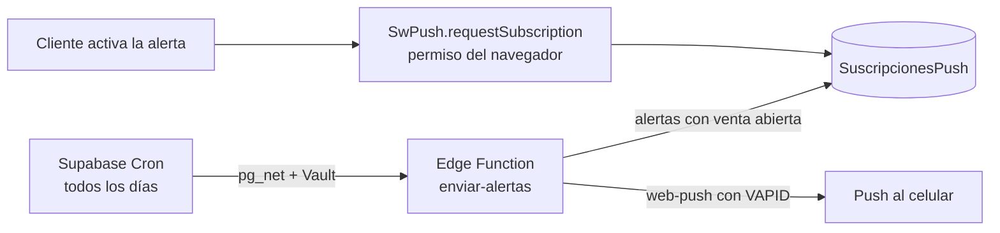

# Olympia Cinema

Aplicación web de un cine de un solo edificio con varias salas. TP 1 de Programación IV,
2026 C2.

- Los **clientes** ven la cartelera, reseñan películas, compran entradas y productos del
  Candy Shop, reciben la
  entrada con QR y en PDF, acumulan y canjean puntos, y cancelan con crédito.
- Los **empleados** validan entradas y retiros del Candy Shop, con la cámara o con el
  código.
- El **administrador** gestiona películas, salas, funciones, el Candy Shop (productos y
  combos), cupones y recompensas, y ve los reportes y el log de actividad.

En pantalla, los productos del cine se llaman **Candy Shop**, y en los reportes del admin la
cantidad de pagos se llama **Operaciones** (cada una puede llevar entradas, Candy Shop o
ambos), para no confundirla con las entradas vendidas (D-62). En el código y en la base los
nombres no cambian (`compras`, `candy`, `ItemsCandy`).

También se puede comprar sin cuenta. La app es una PWA y avisa con notificaciones push
cuando sale a la venta una película de Próximamente.

**Producción:** https://olympiacinema.vercel.app/

### Cuentas de prueba

Son las de los accesos rápidos de la pantalla de login: los tres botones completan el
formulario, y después se toca "Ingresar".

| Rol | Mail | Contraseña |
|---|---|---|
| Admin | `admin@olympia.test` | `Olympia2026!` |
| Empleado | `empleado@olympia.test` | `Olympia2026!` |
| Cliente | `cliente@olympia.test` | `Olympia2026!` |

Son cuentas de demostración: la contraseña está en el código del front a propósito
(aclaración de la cátedra del 01/10, A-02) y no se usa en ningún otro lado.

---

## Tecnologías

- **Angular 22**: componentes standalone (sin `NgModule`), signals para el estado,
  control flow (`@if`, `@for`, `@switch`), `input()` / `output()`, servicios con
  `@Service()` + `inject()`, formularios reactivos, guards funcionales, lazy loading y
  service worker. Estilos con CSS propio, sin librerías de UI.
- **Supabase**:
  - **Auth**: registro e inicio de sesión con mail y contraseña.
  - **Postgres con RLS**: cada tabla tiene políticas por rol. Las operaciones delicadas
    (comprar, cancelar, validar) son funciones de Postgres que se llaman con `rpc()`.
  - **Realtime**: el mapa de butacas se actualiza cuando otro compra.
  - **Storage**: los pósters de las películas, en un bucket público.
  - **Edge Functions**: `enviar-alertas` manda las notificaciones push.
  - **Cron** y **Vault**: ejecutan la Edge Function una vez por día, con la URL y la clave
    guardadas en Vault, fuera del repo.
- **Vercel**: hosting de la app, con HTTPS (lo necesitan la cámara y las notificaciones).
- **PWA**: `@angular/service-worker`, `manifest.webmanifest` e íconos; notificaciones
  push con `SwPush` (claves VAPID).

### Librerías externas

Cada una se justificó y se registró como decisión (la cátedra aprobó usar librerías el
01/10).

| Librería | Para qué | Decisión |
|---|---|---|
| `qrcode` | Generar el QR de la entrada, para la pantalla y el PDF | [D-36](docs/decisiones.md) |
| `jsPDF` | El ticket en PDF y la exportación del reporte de facturación | [D-37](docs/decisiones.md) |
| `html5-qrcode` | Leer el QR con la cámara en la pantalla del empleado | [D-50](docs/decisiones.md) |
| SheetJS (`xlsx`) | Exportar la facturación a Excel. Se instala desde `vendor/` porque la versión de npm está desactualizada | [D-53](docs/decisiones.md) |

Los gráficos de los reportes no usan librería: son barras de CSS (D-54).

---

## Arquitectura

### Carpetas

```
src/app/
  pages/        una carpeta por pantalla con ruta propia (cartelera, compra, mi-cuenta,
                mis-peliculas, empleado-validacion, admin-*...), cargadas con lazy loading
  components/   piezas reutilizables: entrada (QR y PDF), resumen-compra, pago, candy,
                campo-fecha (fechas sin calendario), grafico-barras
  services/     acceso a datos y lógica: un servicio por tema (peliculas, funciones,
                compras, resenias, reportes, log-actividad...). supabase.ts crea el único
                cliente de Supabase
  interfaces/   los tipos del dominio, uno por tabla u operación (Pelicula, PeliculaPorCrear...)
  guards/       logueadoGuard, adminGuard y empleadoGuard
  pipes/        estadoPelicula y estrellas
  validadores/  validadores.ts: los ValidatorFn propios de docs/validaciones.md
src/environments/  la URL y la clave anon de Supabase, y la clave VAPID pública
supabase/
  schema.sql    tablas, RLS, funciones, triggers y vistas, por secciones numeradas
  seed.sql      películas iniciales e historial de prueba para la demo
  functions/enviar-alertas/   la Edge Function de las notificaciones
```

### Cómo fluye un pedido

Los componentes no hablan con Supabase: le piden los datos a un servicio, y el servicio
devuelve los datos o un mensaje de error ya listo para mostrar (`Resultado<T>`). El
componente guarda lo que recibe en signals y el template se redibuja solo.



### Roles y guards

- El rol (`admin`, `empleado` o `cliente`) vive en la tabla `Usuarios`, no en los metadatos
  de Auth, porque esos los puede editar el propio usuario (D-12).
- El servicio `Auth` guarda el usuario y su perfil en signals. Los tres guards son async:
  esperan a que se restaure la sesión antes de decidir, para que recargar la página no
  mande al login a alguien con sesión (D-13).
- Admin y empleado son roles separados: el admin no valida entradas (D-24).
- El menú cambia según haya sesión y según el rol. Pero la protección de verdad está en la
  base: aunque alguien saltee la pantalla desde la consola del navegador, RLS no lo deja
  leer ni escribir lo que no le corresponde.

### Qué vive en la base

- **RLS por rol** en todas las tablas: el catálogo es de lectura pública, cada cliente lee
  solo sus compras, el admin escribe el catálogo y lee lo que necesita para los reportes.
  Las políticas usan `es_admin()` y `es_empleado()`, que leen el rol de `Usuarios`.
- **Funciones con `rpc()`**, que corren en una sola transacción:
  - `realizar_compra`: controla venta abierta, edad, butacas libres, cupón, canjes y
    crédito, calcula los precios en el servidor y guarda todo junto (D-39, D-47).
  - `cancelar_compra`: hasta 2 horas antes, acredita el total como crédito y libera las
    butacas (D-48).
  - `validar_compra`: solo el empleado; la entrada o los productos del Candy Shop se
    entregan una sola vez (D-51).
- **Trigger** `funciones_sin_superposicion`: dos funciones no pueden estar en la misma
  sala a menos de 30 minutos, ni antes del estreno (D-29).
- **Constraints `check`** con las mismas reglas que los formularios (D-25).
- **Vista** `PeliculasMasVendidas` para las 3 más vendidas de la cartelera (D-31).

### Butacas en tiempo real

`ButacasOcupadas` guarda solo función, fila y número: es pública y tiene un `unique` que
hace imposible vender dos veces la misma butaca (D-38). La pantalla de compra se suscribe
con Realtime (`postgres_changes`) a los cambios de esa función y pinta las butacas que se
ocupan o se liberan mientras el usuario elige.

### Notificaciones de Próximamente



Si el cliente no dio permiso, ve un aviso dentro de la app al entrar (D-52).

---

## Decisiones técnicas

El detalle de cada una, con lo descartado y el porqué, está en
[docs/decisiones.md](docs/decisiones.md).

| | Decisión |
|---|---|
| [D-02](docs/decisiones.md) | Angular 22, para usar `@Service()` + `inject()` como en clase |
| [D-03](docs/decisiones.md) | Todo el estado que lee un template va en signals (OnPush por defecto) |
| [D-07](docs/decisiones.md) | Solo se guardan las butacas vendidas: la sala es fija y se arma en el front |
| [D-09](docs/decisiones.md) | Código de compra `OLY-XXXX-XXXX`, distinto del id, que va en el QR |
| [D-11](docs/decisiones.md) | Toda la base sale de un script SQL versionado, `supabase/schema.sql` |
| [D-12](docs/decisiones.md) | El rol vive en `Usuarios` y las políticas lo leen con `rol_actual()` |
| [D-13](docs/decisiones.md) | Guards async que esperan a que se restaure la sesión |
| [D-23](docs/decisiones.md) | Fechas con tres desplegables, sin calendario (pedido del cliente) |
| [D-24](docs/decisiones.md) | Admin y empleado son roles separados |
| [D-25](docs/decisiones.md) | Las reglas de los formularios se repiten como `check` en la base |
| [D-27](docs/decisiones.md) | Cartelera o Próximamente sale de la fecha de estreno, no de una columna |
| [D-29](docs/decisiones.md) | Sala asignada automáticamente; un trigger impide superposiciones |
| [D-35](docs/decisiones.md) | Las horas se muestran siempre en hora argentina |
| [D-38](docs/decisiones.md) | `ButacasOcupadas` pública, con `unique` y Realtime |
| [D-39](docs/decisiones.md) | La compra es una función de Postgres, en una transacción |
| [D-47](docs/decisiones.md) | Orden de las cuentas: precios, canjes, cupón, crédito y medio de pago |
| [D-48](docs/decisiones.md) | La cancelación es una función de Postgres y devuelve crédito, no plata |
| [D-51](docs/decisiones.md) | La validación es una función de Postgres: un solo uso |
| [D-52](docs/decisiones.md) | Alertas con push diario (Cron + Edge Function) y aviso en la app |
| [D-55](docs/decisiones.md) | Los reportes se calculan en el front |
| [D-56](docs/decisiones.md) | Qué cuenta cada reporte (la facturación incluye las canceladas) |
| [D-57](docs/decisiones.md) | Filtros `.in()` y aviso si una consulta llega a 1000 filas |
| [D-58](docs/decisiones.md) | "Vio la película" = compra no cancelada y función ya ocurrida |
| [D-59](docs/decisiones.md) | Una reseña por película, sin autor visible |
| [D-61](docs/decisiones.md) | El log se pagina en la base con `.range()` |
| [D-62](docs/decisiones.md) | En pantalla, "Operaciones" es la cantidad de pagos y "Candy Shop" los productos; el código no cambia |

---

## Cómo correrlo localmente

Necesita **Node 22.22.3 o más nuevo** (lo pide el CLI de Angular 22).

```bash
npm install
ng serve
```

Queda en `http://localhost:4200/`. `npm install` instala SheetJS desde
`vendor/xlsx-0.20.3.tgz`, que está en el repo.

`src/environments/environment.ts` ya tiene los valores del proyecto: `SUPABASE_URL`,
`SUPABASE_KEY` (la clave anon, que es pública, D-10) y `PUBLIC_VAPID` (la clave VAPID
pública). Para apuntar a otro proyecto de Supabase, se cambian esos tres valores. La clave
secret y la VAPID privada no van en el repo: viven en los secrets de Supabase.

### La base en Supabase

En el SQL Editor, en este orden:

1. `supabase/schema.sql` completo. La sección 15.3 (Cron) necesita pasos previos que están
   en `supabase/functions/enviar-alertas/README.md`.
2. `supabase/seed.sql`, secciones 1 y 2 (las películas y sus géneros), **una sola vez**.
3. `supabase/seed.sql`, sección 3 (historial de prueba). Necesita los usuarios de prueba
   creados en Authentication; se puede correr más de una vez.

### La PWA y las notificaciones

Con `ng serve` el service worker está apagado (`enabled: !isDevMode()`, como en la clase
10), así que la PWA y las notificaciones se prueban con el build:

```bash
ng build
npx http-server dist/TP1/browser -p 8080
```

o directamente en Vercel. El navegador solo registra un service worker en `localhost` o con
HTTPS.

---

## Datos de prueba

Los profesores evalúan mirando la app en Vercel, así que la base tiene datos para que cada
pantalla muestre algo. La sección 3 de `supabase/seed.sql` carga:

- 5 clientes de prueba, además de `cliente@olympia.test`.
- 30 funciones pasadas, del 07/09 al 06/10, en distintos horarios y salas.
- Unas 160 compras con códigos `OLY-SEED-…`: algunas canceladas, muchas con la entrada
  validada, un 40 % con productos del Candy Shop, y unas cuantas sobre las funciones
  futuras.
- 26 reseñas con estrellas y comentarios.

Con eso los reportes de facturación y de más vistas tienen meses de historia, la cartelera
tiene sus 3 más vendidas, el mapa muestra butacas ocupadas, y Mi cuenta y Mis películas
tienen contenido. Todo lo que carga se reconoce por la marca `OLY-SEED`, así que se puede
borrar o volver a cargar sin tocar los datos reales.

---

## Documentación

- [Requerimientos](docs/requerimientos.md): qué pidió el cliente, mail por mail, con el
  estado final de cada requisito y las interpretaciones adoptadas.
- [Decisiones](docs/decisiones.md): D-01 a D-61, con lo elegido, lo descartado y el porqué.
- [Validaciones](docs/validaciones.md): las reglas de cada formulario y lo que se repite en
  la base.
- [Modelo de datos](docs/modelo-datos.md): las tablas y qué requisito cubre cada una.
- [Corrección del 01/10](docs/correccion-01-10.md) y [consulta del 06/10](docs/preguntas-consulta.md):
  lo que respondió la cátedra.
- [Catálogo de clases](docs/catalogo-clases.md): lo visto en clase, que es la base de lo
  que usa el TP.
- [Guía para el oral](docs/guia-oral.md): dónde está cada concepto y cómo se explica.
